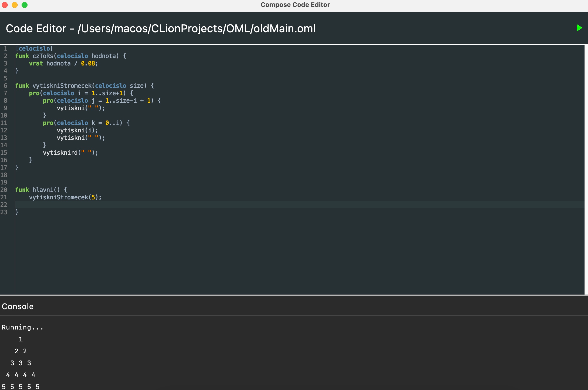

# OML Editor

A Kotlin-based code editor for `.oml` files, built using **JetBrains Compose Multiplatform**. It features syntax highlighting via RSyntaxTextArea, file management (new, open, save, save as), code execution via a custom lexer/parser, and a simple console output panel.

 <!-- optional, update if you have one -->

---

## ✨ Features

- 🧠 **Syntax Highlighting** for `.oml` files using `RSyntaxTextArea`
- 📝 **Basic Editor Functionality**: New, Open, Save, Save As
- ⚡️ **Run Code** button with output displayed in console
- 💾 Automatically opens the **last edited file**
- 💻 Built with **JetBrains Compose for Desktop**
- 🛠 Simple event-driven architecture

---

## 🔤 What is OML?

**OML (Ondřej Moravec Language)** is a lightweight programming language with Czech syntax.

OML was created because I wanted to learn C++ and wanted to create something cool.

**Example OML snippet:**

```oml
funk vytiskniStromecek(celocislo size) {
    pro(celocislo i = 1..size+1) {
        pro(celocislo j = 1..size-i + 1) {
            vytiskni(" ");
        }
        pro(celocislo k = 0..i) {
            vytiskni(i);
            vytiskni(" ");
        }
        vytisknird(" ");
    }
}


funk hlavni() {
	vytiskniStromecek(5);

}
```


